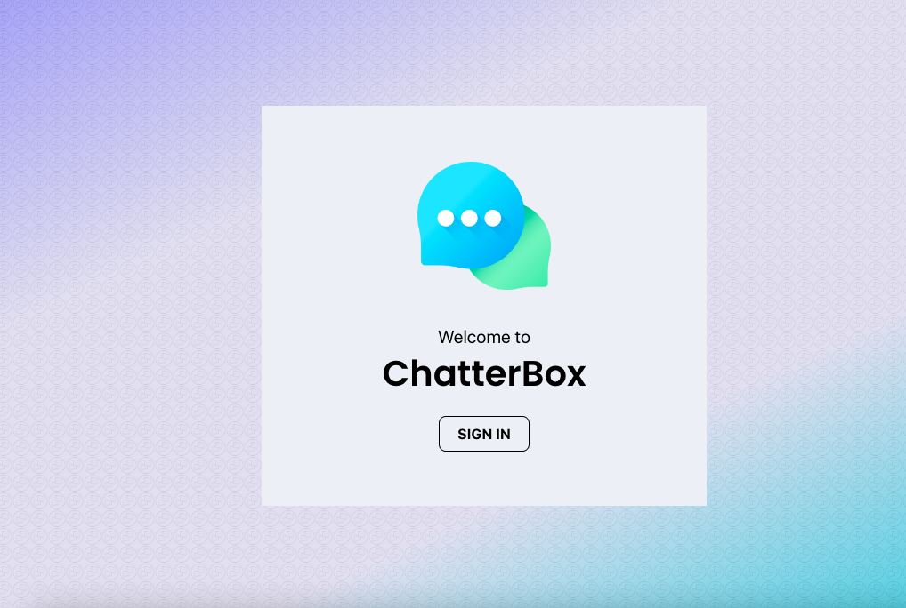
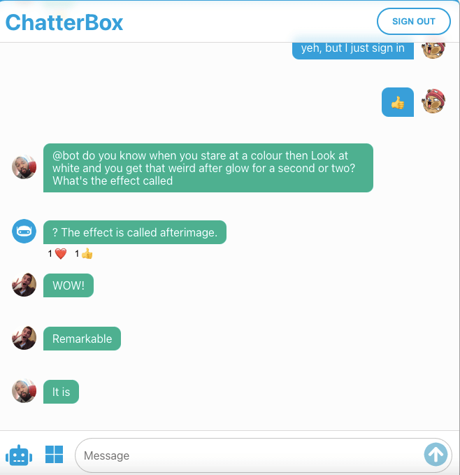
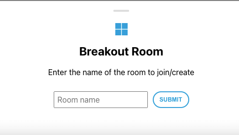
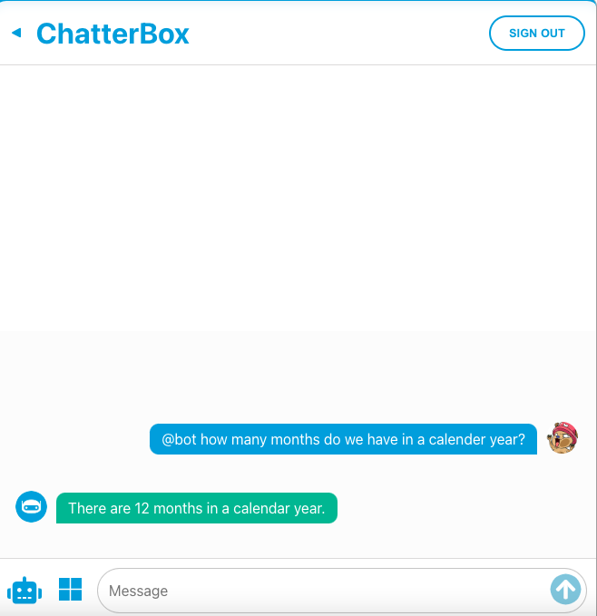

# ChatterBox

[](https://choosealicense.com/licenses/mit/)
[](https://www.contributor-covenant.org/version/2/1/code_of_conduct/)

* Github URL: https://github.com/trunten/ubbc-chatterbox
* Deployed Site: https://chatterbox-web.netlify.app
* Presentation: [PDF File](https://github.com/trunten/ubbc-chatterbox/raw/main/src/images/screenshots/presentation.pdf)
* Desktopp Apps:
   - Mac Intel: [ChatterBox (Mac Intel.zip)](https://drive.google.com/uc?export=download&id=1rKfgN21YIVx1-zgoDZhHTQbKvkLSjPg8)
   - Windows: [ChatterBox (Windows.zip)](https://drive.google.com/uc?export=download&id=15cJbKZ0411rikFFQfq9vxnYc_CNfC4PS)

## Description
* A lightweight WhatsApp like chat app where you can chat with the world about everything, everywhere.
* You can chat with an AI powered chatbot
* You can chat in a breakout room for a more private conversation or about a specific topic.

### Our motivation for development
* We wanted to implement a backend that would update the UI live
* A chat app was a natural fit
* Manageable for 4 people in 2 weeks
* It would be fun for people to be able to chat with anybody in the world about anything and everything.

## Table of contents
- [Acceptance criteria](#acceptance)
- [Installation](#installation)
- [Usage](#usage)
- [Future Development](#future-development)
- [Credits](#credits)
- [Contributing](#contributing)
- [License](#license)

## Acceptance

### User story
```
As a user
- I want to have a lightweight online chat software.
- I want to have a chatbot that I can ask questions and get an answer.
- I  want to interact with other messages, give them likes, thumbs up, etc.
- I also want to have a breakout rooms, so I can have more private chats or conversations about a particular topic.
- SO THAT I can chat with others about anything and  everything.
```

### Acceptance Criteria
* Users can log in through their google account.
* Users can chat with each other in the chatroom.
* Users can ask a chatbot anything they want to know.
* Users can create or join a breakout room to have their own conversations.
* Users can give other messages likes, thumbs up and laughs.
* Users can delete their own message.

The application will be complete when it satisfies all of the above acceptance criteria plus the following:
* Uses use ReactJS,Node.
* Have both GET and POST routes for retrieving and adding new data
* Deploy this application using Netlify.
* At least two libraries, packages, or technologies that we haven't discussed.      
* Have a polished front end/UI.

### The APIs we used and the function
* Use [Firebase API](https://firebase.google.com) for entire backend and user authentication / sign-in
* Use [Chat GPT API](https://platform.openai.com/docs/introduction) for chatbot
* Use [Geocoding to City API](https://www.bigdatacloud.com/docs/api/free-reverse-geocode-to-city-api) to get user location for weather query
* Use [Weather API](https://www.visualcrossing.com) for current weather
* NPM packages used in the project
    * [react-toastify](https://www.npmjs.com/package/react-toastify), React notification made easy (npm i react-toastify)
    * [firebase](https://www.npmjs.com/package/firebase), Firebase JavaScript library for web and Node.js(npm i firebase) 
    * [framer-motion](https://www.npmjs.com/package/framer-motion), A simple and powerful React and JavaScript animation library(npm i framer-motion) 
    * [react-firebase-hooks](https://www.npmjs.com/package/react-firebase-hooks), React Hooks for Firebase (npm i react-firebase-hooks)
    * [react-icons](https://www.npmjs.com/package/react-icons), SVG React icons of popular icon packs using ES6 imports(npm i react-icons)
    * [react-linkify](https://www.npmjs.com/package/react-linkify), React component to parse links (urls, emails, etc.) in text into clickable links(npm i react-linkify) 
    * [react-modal-sheet](https://www.npmjs.com/package/react-modal-sheet), Flexible bottom sheet component for your React apps(npm i react-modal-sheet) 

## Installation
Run <code>npm start</code>

## Usage
- [Deployed Application](https://chatterbox-web.netlify.app)
- Login with your goole account by clicking on the sign in button
- Type messages in the message input field at the buttom of the app and click the arrow to send
- Hover over/tap on message bubbles to add/remove emoji reactions or delete your own messages
- Tap/Click the breakout room button to the left of the input field to join/create a new chat room
   - Leave a breakout room at any point by clicking the back arrow in the header (top left)
- type <code>@bot</code> followed by your message to talk to the chatbot
- type <code>@weather</code> to get your current weather
- Hover over/tap on message bubbles to view message timestamps
- Sign out at any time by clicking the sign out button.

 ### App screenshots
<table>
   <tr>
      <td></td>
      <td></td>
   </tr>
   <tr>
      <td></td>
      <td></td>
   </tr>
</table> 

## Future Development
* Custom emoji reactions
* Message edits
* Breakout room directory
* npm package - react-firechat!
* Profanity filter (or use the perspective api to get AI filtering of harmful/toxic comments)

## Credits
- App icons: [flaticon.com](https://www.flaticon.com) & [react icons](https://marketplace.visualstudio.com/items?itemName=afzalsayed96.reacticons)

## Contributing
Pull requests are welcome. For major changes, please open an issue first to discuss what you would like to change.

This repo adopts the [Contributor Covenant](https://www.contributor-covenant.org/version/2/1/code_of_conduct/) for contributing guidlines.

## License
[](https://choosealicense.com/licenses/mit/)

This project is licensed under the [MIT License](https://choosealicense.com/licenses/mit/)

Refer to the [license](LICENSE) in the repo
